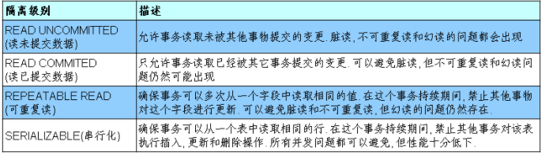

该笔记根据尚学堂*JDBC*课程的笔记修改（自己吸收理解后留下的笔记用作日后复习）

*JDBC*介绍

- *JDBC(Java Database Connectivity)*是一个**独立于特定数据库管理系统、通用的*SQL*数据库存取和操作的公共接口**（一组*AP*I），定义了用来访问数据库的标准*Java*类库，*（**java.sql,javax.sql**）*使用这些类库可以以一种**标准**的方法、方便地访问数据库资源。
- *JDBC*的目标是使*Java*程序员使用*JDBC*可以连接任何**提供了JDBC驱动程序**的数据库系统，这样就使得程序员无需对特定的数据库系统的特点有过多的了解，从而大大简化和加快了开发过程。


#### *JDBC*程序编写步骤


​	需要连接数据图提供的驱动，加载驱动后获取连接开始执行后续的操作

#### 获取数据库连接

​	获取数据库连接需要的参数：*url，user，password*以及驱动。**现在版本我们已经不需要自己去连接驱动了，因为*DriverManager*或者*Driver*的静态代码块已经帮我们去加载了**。所以我们要获取前面三个参数，可以从配置文件中获取

*Jdbc.properties:* 放在*src*目录下 

```properties
user=root
password=123456
url=jdbc:mysql://localhost:3306/test
# 驱动可以不要了 com.mysql.cj.jdbc.Driver 
driverClass=com.mysql.jdbc.Driver 
```

```java
	@Test
    public  void testConnection5() throws Exception {
    	// 1.加载配置文件
        InputStream is = ConnectionTest.class.getClassLoader().getResourceAsStream("jdbc.properties");
        Properties pros = new Properties();
        pros.load(is);
        
        // 2.读取配置信息
        String user = pros.getProperty("user");
        String password = pros.getProperty("password");
        String url = pros.getProperty("url");
        // String driverClass = pros.getProperty("driverClass");

        // 3.加载驱动 现在不需要自己加载了 这边是为了走Driver的静态代码块
        // Class.forName(driverClass);

        // 4.获取连接
        Connection conn = DriverManager.getConnection(url,user,password);
        System.out.println(conn);

    }
```

以下是*DriverManager*中的注释：


##### *JDBCUtils*

​	提取连接数据库的操作，封装成*JDBCUtils*

```java
public class JDBCUtils {

    public static Connection getConnection() throws Exception {
        InputStream is = ClassLoader.getSystemResourceAsStream("jdbc.properties");
        Properties properties = new Properties();
        properties.load(is);

        String url = properties.getProperty("url");
        String user = properties.getProperty("user");
        String password = properties.getProperty("password");

        return DriverManager.getConnection(url, user, password);
    }

    public static void closed(Connection con, Statement statement) {

        try {
            if (con != null)
                con.close();
            if (statement != null)
                statement.close();
        } catch (SQLException ex) {
            ex.printStackTrace();
        }
    }

    public static void closed(Connection con, Statement statement, ResultSet set) {
        closed(con, statement);

        try {
            if (set != null)
                set.close();
        } catch (SQLException ex) {
            ex.printStackTrace();
        }
    }
}
```

#### 操作与访问数据库

##### *Statement*

使用*Statement*操作数据表存在弊端：

- 存在拼串操作，繁琐
- 存在*SQL*注入问题：*SQL* 注入是利用某些系统没有对用户输入的数据进行充分的检查，而在用户输入数据中注入非法的 *SQL* 语句段或命令*(如：SELECT user, password FROM user_table WHERE user='a' OR 1 = ' AND password = ' OR '1' = '1')* ，从而利用系统的 *SQL* 引擎完成恶意行为的做法。

##### *PreparedStatement*

- *PreparedStatement* 可以防止 *SQL* 注入 
- *DBServer*会对**预编译**语句提供性能优化。因为预编译语句有可能被重复调用，所以<u>语句在被*DBServer*的编译器编译后的执行代码被缓存下来，那么下次调用时只要是相同的预编译语句就不需要编译，只要将参数直接传入编译过的语句执行代码中就会得到执行。</u>

##### *PreparedStatement*的增删改

```java
// 通用的增、删、改操作（体现一：增、删、改 ； 体现二：针对于不同的表）
	public void update(String sql,Object ... args){
		Connection conn = null;
		PreparedStatement ps = null;
		try {
			// 1.获取数据库的连接
			conn = JDBCUtils.getConnection();
			
			//2 .获取PreparedStatement的实例 (或：预编译sql语句)
			ps = conn.prepareStatement(sql);
			//3 .填充占位符
			for(int i = 0;i < args.length;i++){
				ps.setObject(i + 1, args[i]);
			}
			
			// 4.执行sql语句
			ps.execute();
		} catch (Exception e) {
			
			e.printStackTrace();
		}finally{
			// 5.关闭资源
			JDBCUtils.closeResource(conn, ps);
			
		}
	}
```

##### *PreparedStatement*的查询

```java
// 通用的针对于不同表的查询:返回一个对象 
	public <T> T getInstance(Class<T> clazz, String sql, Object... args) {

		Connection conn = null;
		PreparedStatement ps = null;
		ResultSet rs = null;
		try {
			// 1.获取数据库连接
			conn = JDBCUtils.getConnection();

			// 2.预编译sql语句，得到PreparedStatement对象
			ps = conn.prepareStatement(sql);

			// 3.填充占位符
			for (int i = 0; i < args.length; i++) {
				ps.setObject(i + 1, args[i]);
			}

			// 4.执行executeQuery(),得到结果集：ResultSet
			rs = ps.executeQuery();

			// 5.得到结果集的元数据：ResultSetMetaData
			ResultSetMetaData rsmd = rs.getMetaData();

			// 6.1通过ResultSetMetaData得到columnCount,columnLabel；通过ResultSet得到列值
			int columnCount = rsmd.getColumnCount();
			if (rs.next()) {
				T t = clazz.newInstance();
				for (int i = 0; i < columnCount; i++) {// 遍历每一个列

					// 获取列值
					Object columnVal = rs.getObject(i + 1);
					// 获取列的别名:列的别名，使用类的属性名充当
					String columnLabel = rsmd.getColumnLabel(i + 1);
					// 6.2使用反射，给对象的相应属性赋值
					Field field = clazz.getDeclaredField(columnLabel);
					field.setAccessible(true);
					field.set(t, columnVal);

				}

				return t;

			}
		} catch (Exception e) {

			e.printStackTrace();
		} finally {
			// 7.关闭资源
			JDBCUtils.closeResource(conn, ps, rs);
		}

		return null;

	}
```

##### 关于*ResultSetMetaData*

1. **如何获取 *ResultSetMetaData***： 调用 *ResultSet* 的 *getMetaData()* 方法即可
2. **获取 *ResultSet* 中有多少列**：调用 *ResultSetMetaData* 的 *getColumnCount()* 方法
3. **获取 *ResultSet* 每一列的列的别名是什么**：调用 *ResultSetMetaData* 的*getColumnLabel()* 方法

#### 操作*BLOB*类型字段

​	*MYSQL*的四种*Blob*类型，除了最大信息量不同，他们是一样的


##### 插入大数据类型

```java
// 获取连接
Connection conn = JDBCUtils.getConnection();
		
String sql = "insert into ...";
PreparedStatement ps = conn.prepareStatement(sql);

// 填充占位符
ps.setString(1, "xxx");
ps.setString(2, "xxx");
ps.setDate(3, "xxx");
// 操作Blob类型的变量
FileInputStream fis = new FileInputStream(path);
ps.setBlob(4, fis);
//执行
ps.execute();
		
fis.close();
JDBCUtils.closeResource(conn, ps);


```

##### 从数据表中读取大数据类型

```java
String sql = "SELECT xxx FROM ... WHERE id = ?";
conn = getConnection();
ps = conn.prepareStatement(sql);
ps.setInt(1, 8);
rs = ps.executeQuery();
if(rs.next()){
	Integer id = rs.getInt(1);
    // 读取Blob类型的字段
	Blob photo = rs.getBlob(5);
	InputStream is = photo.getBinaryStream();
	OutputStream os = new FileOutputStream("c.jpg");
	byte [] buffer = new byte[1024];
	int len = 0;
	while((len = is.read(buffer)) != -1){
		os.write(buffer, 0, len);
	}
    JDBCUtils.closeResource(conn, ps, rs);
		
	if(is != null){
		is.close();
	}
		
	if(os !=  null){
		os.close();
	}
    
}
```

#### 批量插入

​	*JDBC*的批量处理语句包括下面三个方法：

- ***addBatch(String)：*添加需要批量处理的*SQL*语句或是参数；**
- ***executeBatch()：*执行批量处理语句；**
- ***clearBatch():* 清空缓存的数据**

通常我们会遇到两种批量执行*SQL*语句的情况：

- 多条*SQL*语句的批量处理；
- 一个*SQL*语句的批量传参；

##### 实现

```java
/*
* 层次四：在层次三的基础上操作
* 使用Connection 的 setAutoCommit(false)  /  commit()
*/
@Test
public void testInsert2() throws Exception{
	long start = System.currentTimeMillis();
		
	Connection conn = JDBCUtils.getConnection();
		
	// 1.设置为不自动提交数据
	conn.setAutoCommit(false);
		
	String sql = "insert into goods(name)values(?)";
	PreparedStatement ps = conn.prepareStatement(sql);
		
	for(int i = 1;i <= 1000000;i++){
		ps.setString(1, "name_" + i);
			
		// 1.“攒”sql
		ps.addBatch();
			
		if(i % 500 == 0){
			// 2.执行
			ps.executeBatch();
			// 3.清空
			ps.clearBatch();
		}
	}
		
	// 2.提交数据
	conn.commit();
		
	long end = System.currentTimeMillis();
	System.out.println("花费的时间为：" + (end - start));//1000000条:4978 
		
	JDBCUtils.closeResource(conn, ps);
}
```

####  数据库事务

##### 事务的*ACID*属性  

1. **原子性*（Atomicity）***
   原子性是指事务是一个不可分割的工作单位，事务中的操作要么都发生，要么都不发生。 
2. **一致性*（Consistency）***
   事务必须使数据库从一个一致性状态变换到另外一个一致性状态。
3. **隔离性*（Isolation）***
   事务的隔离性是指一个事务的执行不能被其他事务干扰，即一个事务内部的操作及使用的数据对并发的其他事务是隔离的，并发执行的各个事务之间不能互相干扰。
4. **持久性*（Durability）***
   持久性是指一个事务一旦被提交，它对数据库中数据的改变就是永久性的，接下来的其他操作和数据库故障不应该对其有任何影响。

##### 数据库的并发问题

对于同时运行的多个事务, 当这些事务访问数据库中相同的数据时, 如果没有采取必要的隔离机制, 就会导致各种并发问题**（针对的是隔离性）**：

- 脏读：一个事物读到了另一个事物还未提交的字段
- 不可重复读：一个事物在一个连接的情况下（未关闭连接或者未提交），读取到了另一个事务**修改**后的字段（前后两次读不一样）。
- 幻读：一个事物在一个连接的情况下（未关闭连接或者未提交），读取到了另一个事务**插入**后的字段（前后两次读不一样）。

不可重复度和幻读主要区别是针对的操作不同，不可重复度针对的是修改，幻读针对的是插入。

##### 数据库隔离级别



 **隔离级别越高, 数据一致性就越好, 但并发性越弱**

- *Oracle* 支持的 *2* 种事务隔离级别：***READ COMMITED, SERIALIZABLE。 Oracle*** 默认的事务隔离级别为: ***READ COMMITED***。

- *Mysql* 支持 *4* 种事务隔离级别。*Mysql* 默认的事务隔离级别为: ***REPEATABLE READ。***

通常我们要解决的是脏读的问题，不可重复读和幻读是可以接受的。

##### *JDBC*事务处理

数据库的自动提交有如下情况：

1. *DDL*一旦操作就会自己提交 

2. *DML*默认情况下操作就会自己提交

3. 关闭数据库连接时会自动提交

**我们应该使用一个连接来完成多个语句的操作，也就是用一个事务来执行多个*SQL*语句的操作**：

- 调用 *Connection* 对象的 ***setAutoCommit(false)*** 以取消自动提交事务
- 在所有的 *SQL* 语句都成功执行后，调用 ***commit()*** 方法提交事务
- 在出现异常时，调用 ***rollback()*** 方法回滚事务

> 若此时 Connection 没有被关闭，还可能被重复使用，则需要恢复其自动提交状态 setAutoCommit(true)。尤其是在使用数据库连接池技术时，执行close()方法前，建议恢复自动提交状态。

模拟转账

```java
public void testJDBCTransaction() {
	Connection conn = null;
	try {
		// 1.获取数据库连接
		conn = JDBCUtils.getConnection();
		// 2.开启事务
		conn.setAutoCommit(false);
		// 3.进行数据库操作
		String sql1 = "update user_table set balance = balance - 100 where user = ?";
		update(conn, sql1, "AA");

		// 模拟网络异常
		//System.out.println(10 / 0);

		String sql2 = "update user_table set balance = balance + 100 where user = ?";
		update(conn, sql2, "BB");
		// 4.若没有异常，则提交事务
		conn.commit();
	} catch (Exception e) {
		e.printStackTrace();
		// 5.若有异常，则回滚事务
		try {
			conn.rollback();
		} catch (SQLException e1) {
			e1.printStackTrace();
		}
    } finally {
        try {
			//6.恢复每次DML操作的自动提交功能
			conn.setAutoCommit(true);
		} catch (SQLException e) {
			e.printStackTrace();
		}
        //7.关闭连接
		JDBCUtils.closeResource(conn, null, null); 
    }  
}
```

其中，对数据库操作的方法为：

```java
// 使用事务以后的通用的增删改操作
public void update(Connection conn ,String sql, Object... args) {
	PreparedStatement ps = null;
	try {
		// 1.获取PreparedStatement的实例 (或：预编译sql语句)
		ps = conn.prepareStatement(sql);
		// 2.填充占位符
		for (int i = 0; i < args.length; i++) {
			ps.setObject(i + 1, args[i]);
		}
		// 3.执行sql语句
		ps.execute();
	} catch (Exception e) {
		e.printStackTrace();
	} finally {
		// 4.关闭资源
		JDBCUtils.closeResource(null, ps);
	}
}
```

#### 数据库连接池 

#####  *JDBC*数据库连接池的必要性

- 在使用开发基于数据库的*web*程序时，传统的模式基本是按以下步骤：　　
  - **在主程序*（如servlet、beans*）中建立数据库连接**
  - **进行*sql*操作**
  - **断开数据库连接**
- 这种模式开发，存在的问题:
  - 普通的*JDBC*数据库连接使用 *DriverManager* 来获取，每次向数据库建立连接的时候都要将 *Connection* 加载到内存中，再验证用户名和密码(得花费*0.05s～1s*的时间)。需要数据库连接的时候，就向数据库要求一个，执行完成后再断开连接。这样的方式将会消耗大量的资源和时间。**数据库的连接资源并没有得到很好的重复利用。**若同时有几百人甚至几千人在线，频繁的进行数据库连接操作将占用很多的系统资源，严重的甚至会造成服务器的崩溃。
  - **对于每一次数据库连接，使用完后都得断开。**否则，如果程序出现异常而未能关闭，将会导致数据库系统中的内存泄漏，最终将导致重启数据库。
  - **这种开发不能控制被创建的连接对象数**，系统资源会被毫无顾及的分配出去，如连接过多，也可能导致内存泄漏，服务器崩溃。 

##### 数据库连接池技术

- 为解决传统开发中的数据库连接问题，可以采用数据库连接池技术。
- **数据库连接池的基本思想**：就是为数据库连接建立一个“缓冲池”。预先在缓冲池中放入一定数量的连接，当需要建立数据库连接时，只需从“缓冲池”中取出一个，使用完毕之后再放回去。
- **数据库连接池**负责分配、管理和释放数据库连接，它**允许应用程序重复使用一个现有的数据库连接，而不是重新建立一个**。
- 数据库连接池在初始化时将创建一定数量的数据库连接放到连接池中，这些数据库连接的数量是由**最小数据库连接数来设定**的。无论这些数据库连接是否被使用，连接池都将一直保证至少拥有这么多的连接数量。连接池的**最大数据库连接数量**限定了这个连接池能占有的最大连接数，当应用程序向连接池请求的连接数超过最大连接数量时，这些请求将被加入到等待队列中。

##### 数据库连接池技术的优点

**1. 资源重用**

由于数据库连接得以重用，避免了频繁创建，释放连接引起的大量性能开销。在减少系统消耗的基础上，另一方面也增加了系统运行环境的平稳性。

**2. 更快的系统反应速度**

数据库连接池在初始化过程中，往往已经创建了若干数据库连接置于连接池中备用。此时连接的初始化工作均已完成。对于业务请求处理而言，直接利用现有可用连接，避免了数据库连接初始化和释放过程的时间开销，从而减少了系统的响应时间

**3. 新的资源分配手段**

对于多应用共享同一数据库的系统而言，可在应用层通过数据库连接池的配置，实现某一应用最大可用数据库连接数的限制，避免某一应用独占所有的数据库资源

**4. 统一的连接管理，避免数据库连接泄漏**

在较为完善的数据库连接池实现中，可根据预先的占用超时设定，强制回收被占用连接，从而避免了常规数据库连接操作中可能出现的资源泄露

##### 使用*Druid*

​	使用*Druid*代替原来的获取连接的方法。

```java
public static void main(String[] args) throws Exception {
		Properties pro = new Properties();		 pro.load(TestDruid.class.getClassLoader().getResourceAsStream("druid.properties"));
		DataSource ds = DruidDataSourceFactory.createDataSource(pro);
		Connection conn = ds.getConnection();
		System.out.println(conn);
	}
```


*druid.properties:*

```properties
url=jdbc:mysql://localhost:3306/test?rewriteBatchedStatements=true
username=root
password=123456
driverClassName=com.mysql.jdbc.Driver

initialSize=10
maxActive=20
maxWait=1000
filters=wall
```

#### *Apache-DBUtils*实现*CRUD*操作

​	*commons-dbutils* 是 *Apache* 组织提供的一个开源 *JDBC*工具类库，它是对*JDBC*的简单封装，学习成本极低，并且使用*dbutils*能极大简化*jdbc*编码的工作量，同时也不会影响程序的性能。

##### *QueryRunner*类

​	该类简单化了*SQL*查询，它与*ResultSetHandler*组合在一起使用可以完成大部分的数据库操作，能够大大减少编码量。

- *QueryRunner*类提供了两个构造器：
  - 默认的构造器
  - 需要一个 *javax.sql.DataSource* 来作参数的构造器
- *QueryRunner*类的主要方法：
  - **更新**
    - *public int update(Connection conn, String sql, Object... params) throws SQLException:*用来执行一个更新（插入、更新或删除）操作。
  - **插入**
    - *public \<T\> T insert(Connection conn,String sql,ResultSetHandler\<T\> rsh, Object... params) throws SQLException：*只支持*INSERT*语句，其中 *rsh - The handler used to create the result object from the ResultSet of auto-generated keys.*  返回值: *An object generated by the handler.*即自动生成的键值
  - **批处理**
    - *public int[] batch(Connection conn,String sql,Object[][] params)throws SQLException： INSERT, UPDATE, or DELETE*语句
    - *public \<T\> T insertBatch(Connection conn,String sql,ResultSetHandler\<T\> rsh,Object[][] params)throws SQLException：*只支持*INSERT*语句
  - **查询**
    - *public Object query(Connection conn, String sql, ResultSetHandler rsh,Object... params) throws SQLException：*执行一个查询操作，在这个查询中，对象数组中的每个元素值被用来作为查询语句的置换参数。该方法会自行处理 *PreparedStatement* 和 *ResultSet* 的创建和关闭。

##### *ResultSetHandler*接口及实现类

​	该接口用于处理 *java.sql.ResultSet*，将数据按要求转换为另一种形式。

- *ResultSetHandler* 接口提供了一个单独的方法：*Object handle (java.sql.ResultSet .rs)*：即实现类将会返回这个方法的结果
- 接口的主要实现类：
  - *ArrayHandler*：把结果集中的第一行数据转成对象数组。
  - *ArrayListHandler*：把结果集中的每一行数据都转成一个数组，再存放到*List*中。
  - ***BeanHandler*：**将结果集中的第一行数据封装到一个对应的*JavaBean*实例中。
  - ***BeanListHandler*：**将结果集中的每一行数据都封装到一个对应的*JavaBean*实例中，存放到*List*里。
  - *ColumnListHandler*：将结果集中某一列的数据存放到*List*中。
  - *KeyedHandler(name)*：将结果集中的每一行数据都封装到一个*Map*里，再把这些*map*再存到一个*map*里，其*key*为指定的*key*。
  - ***MapHandler*：**将结果集中的第一行数据封装到一个*Map*里，key*是列名*，*value*就是对应的值。
  - ***MapListHandler*：**将结果集中的每一行数据都封装到一个*Map*里，然后再存放到*List*
  - ***ScalarHandler*：**查询单个值对象