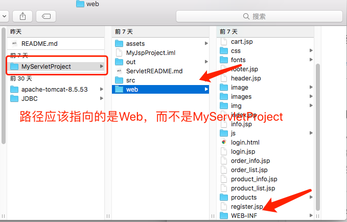
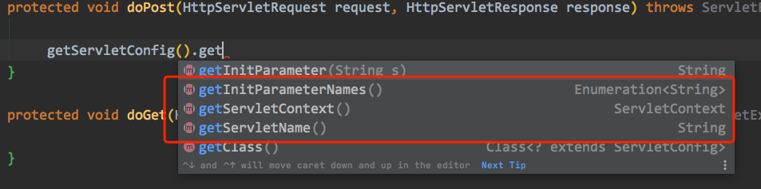
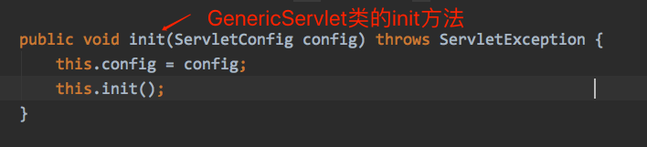
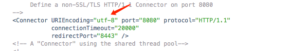
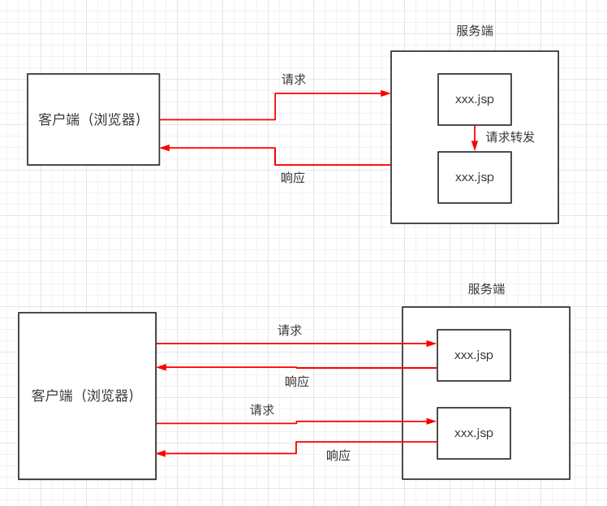
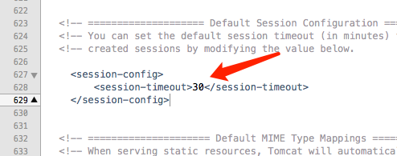

#### 虚拟路径（*tomcat*官方推荐部署方式）

通常我们将项目放在*tomcat*的*webapps*目录下，我们还可以采用以下方式：

进入*tomcat*的*Catalina*的*localhost*目录下配置 *xxx.xml*， *xxx*即访问路径

如果名为*ROOT*则不需要写上名字

```java
<Context docBase="/Users/wentimei/Downloads/jspProject"  />
```

*docBase*: 项目的实际路径，路径应该指向的是*WEB-INF*的上一级



如果有多个项目则配置多个*xml*即可

### *Servlet*

#### *servlet*中路径总结

1. *web.xml*

*web.xml*中路径以 /开头表示： *http://ip地址:端口号/项目名称*

2. *jsp*

*jsp*中以/开头表示：  *http://ip地址:端口号*

不以/开头表示： *http://ip地址:端口号/项目名称*

3. 转发*&*重定向

- 转发中都表示 *http://ip地址:端口号/项目名称*
- 重定向同*jsp*

转发和重定向在*jsp*中和*servlet*中一样使用

#### *servlet*下获取资源问题

https://www.cnblogs.com/deng-cc/p/7152988.html

*Servlet：* 运行在服务端的Java*小程序*，是*sun*公司提供一套规范，用**来处理客户端请求、响应给浏览器的动态资源**

#### *Servlet*声明周期

1. 构造*Servlet*，然后使用*init*方法初始化
2. 每次都会调用service方法处理客户端的请求
3. *destroy*在*web*工程停止时调用

#### *ServletConfig*

*Servlet*程序的配置信息类



- 获取*Servlet*的别名即*\<servlet-name\>*
- 获取初始化参数
- 获取*ServletContext*对象

*Servlet*程序和*ServletConfig*对象都是有*Tomcat*负责创建，我们负责使用

*Servlet*默认是程序第一次访问时创建，每个*Servlet*的创建都会有一个对应的*ServletConfig*对象创建

也就是*ServletConfig*是独立存在的，如果自己的*Servlet*要重写*init*方法应该要调用父类的初始化方法，因为父类的*init*方法给*ServletConfig*进行了赋值



#### ServletContext域对象

*ServletContext*是一个接口表示上下文对象

***ServletContext*在*web*工程启动时创建，停止时销毁**

**每个web工程只有一个*ServletContext***

*ServletContext*对象是一个域对象（像*map*一项存取数据）

##### 作用

- 获取*web.xml*的上下文参数*(getInitParameter)*

- 获取虚拟路径 *(getContextPath)*

- 根据虚拟路径获取绝对路径*（getRealPath）*

> */* 斜杠被服务器解析地址为: *http://ip:port/工程名/* *映射到* *IDEA* *代码的* *web* 目录

- 存取数据*(setAttribute, getAttribute, removeAttribute)*

#### *HttpServletRequest*

*Tomcat*会把每次请求的*HTTP*协议信息解析好封装到*HttpServletRequst*中，传递到*service（doGet、doPost）*中给我们使用。通过*HttpServletRequst*，可以获取到所有的请求信息。

##### 获取中文参数乱码

原因：页面提交的参数是以*utf-8*进行编码的，而服务端获取参数时使用的*iso8859-1*,编解码不一致导致了乱码

###### *doGet*

需要进行字符串的重构

*username = **new** String(username.getBytes("iso-8859-1"), "utf-8");*

*Tomcat 8.0*以上版本中注意*server.xml*的*Connector*编码 如果不是*utf-8*也要进行重构，或者修改编码。（如果是*utf-8*则*Get*不会乱码）



###### *doPost*

*request.setCharacterEncoding(“utf-8”);*

##### *request*生命周期

发送请求时创建，请求结束时销毁

##### *request*域对象

*request*也是一个域对象，所以也可以存取数据*(setAttribute, getAttribute, removeAttribute)*

*request*作为域对象来存储数据时**必须结合<u>请求转发</u>来使用，否则就没有任何意义。**

##### *request*请求转发

请求转发只能在项目内转发

获得请求转发器：

```java
RequestDispatcher getRequestDispatcher(String path)
```

通过转发器对象转发：

```java
forward(ServletRequest request, ServletResponse response)
```

###### 请求转发的路径

```java
// 这里的路径 不管是绝对路径还是相对路径都是一样的，都表示 http://ip地址:端口号/项目名称
request.getRequestDispatcher("sessionDemo/session.jsp").forward(request, response);
```

###### 转发与重定向的区别

- 重定向的地址栏会发生变化，转发不会
- **重定向两次请求两次响应，转发一次请求一次响应**
- 重定向路径需要加工程名，转发不需要
- 重定向可以跳转到任意页面，转发只能在服务器内部进行转发

*转发和重定向：*



###### 转发与重定向使用时机

- 看跳转是否在项目内，在项目内都可以，项目外必须重定向
- 是否需要携带数据，如果传递参数用转发，否则重定向
- 重定向可以防止表单重复提交，转发不可以

#### *HttpServletResponse*

每次请求进来，*Tomcat* 服务器都会创建一个 *Response* 对象传递给 *Servlet* 程序去使用。*HttpServletRequest* 表示请求过来的信息，*HttpServletResponse* 表示所有响应的信息

##### 输出流

*getOutPutStream():* 字节流，常用语下载（传递二进制数据）

*getWriter():* 字符流，常用语回传字符串

**两个流同时只能使用一个！否则会报错**

***Tomcat*会自动调用*response*输出流的 *close*方法和*flush*方法, 因此不需要我们手动关闭流**

##### 响应乱码

第一种方式：

```java
// 设置服务器字符集为 UTF-8 
resp.setCharacterEncoding("UTF-8"); 
// 通过响应头，设置浏览器也使用 UTF-8 字符集 
resp.setHeader("Content-Type", "text/html; charset=UTF-8");
```

第二种方式：

```java
/*
  它会同时设置服务器和客户端都使用 UTF-8 字符集，还设置了响应头
  此方法一定要在获取流对象之前调用才有效 
*/
resp.setContentType("text/html; charset=UTF-8");
```

##### 重定向

第一种方式：

```java
// 设置响应状态码 302 ，表示重定向
resp.setStatus(302); 
// 设置响应头，说明 新的地址在哪里 
resp.setHeader("Location", "http://localhost:8080");
```

第二种方式：

```java
resp.sendRedirect("http://localhost:8080");
```

###### 重定向的路径

```java
// 下面三种方式都可以重定向到指定位置
 response.sendRedirect(getServletContext().getContextPath() +    "/sessionDemo/session.jsp");
 response.sendRedirect("sessionDemo/session.jsp");
 response.sendRedirect("/servletProject/sessionDemo/session.jsp");
```

#### *Cookie*

 *Cookie*是将用户的信息保存到**客户端**浏览器的一个技术,当下次访问的时候,浏览器会自动携带*Cookie*的信息过来到服务器端.

*addCookie*即把*Cookie*响应给客户端

*Cookie*存在于客户端，却是由服务器产生发送给客户端的，起初有个*JSESSIONID*是服务器自动生成给客户端的

**相当于本地缓存的作用，可以提高效率，但是不够安全，最多只能存储*4kb*的数据，*key*和*value*都是*String*类型的**

##### 生存时间

*Cookie*的默认生成时间是一次会话，*cookie.setMaxAge()*可以设置生存时间，单位为秒

不主动设置*MaxAge*，默认*MaxAge<0*，即*cookie*存在于浏览器内存中，Cookie随浏览器关闭而消失即一次会话

设置*MaxAge>0*，响应持久性*Cookie*，会存在电脑硬盘的特定文件夹下

设置特定*Cookie*的*MaxAge=0*，则会删除已经存在客户端的此*Cookie：*

```java
Cookie cookie = new Cookie("","");
cookie.setMaxAge(0);
response.addCookie(cookie);
```

#### *Session*

*Session*就是会话，它是用来维护一个客户端和服务器之间关联的一种技术

相比较*Cookie*存在客户端，*Session*则是服务端的东西

##### *Session*机制

客户端第一次访问服务端时，服务端会产生一个*session*对象（用于存储客户信息），并且每个*session*对象都有一个唯一的*sessionId*（用于区分其他*session*）。服务端还会产生一个*cookie*，*name=JSESSIONID，value=sessionId*。服务端会在响应客户端的时候将*cookie*发送给客户端。因此客户端就有了*cookie*和服务端*session*一一对应。

也就是说当客户端访问服务器，看是否有*cookie（JESSIONID）*能和服务端的*session（sessionId）*对应起来，没有则创建

##### 生命周期

在 *Tomcat* 服务器的配置文件 *web.xml*中默认有以下的配置，它就表示配置了当前 *Tomcat* 服务器下所有的 *Session* 

超时配置默认时长为：*30* 分钟。 



如果想配置所有Session的超时时长，在自己项目中的web.xml中配置以上信息即可。

如果想单独配置某个Session的时长可以通过*setMaxInactiveInterval(int interval)*来配置单位为秒。

**注意：** ***session*只作用于一次会话，也就是说，一旦会话结束，之后再访问就获取不到数据了。**

*cookie*默认为一次会话，关闭浏览器之后*cookie*销毁。关闭浏览器后仅仅是丢失*session*的*id*即JSESSIONID，从而导致找不到session，**而session本身还是存在的**。如果再次访问服务器，就会创建新的*cookie*。如果想要一次会话之后仍能识别原来的客户端，只需要设置*cookie（JSESSIONID）*的持久化即可。

> [浏览器关闭后，Session就销毁了吗？](https://blog.csdn.net/QQ1012421396/article/details/70842148)

###### *Session*序列化

当服务器关闭之后，会生成一个叫*SESSIONS.ser*的文件用来保存所有的session信息，该文件生成在*Tomcat*的*work/Catalina/localhost/项目*下。当启动服务器是，该文件被读取并销毁。

##### 使用

```java
// 获取session
Session session = request.getSession();
// 存
session.setAttribute("", obj);
// 取
Object obj = session.getAttribute("");
// 销毁所有的session
session.invalidate();
// 销毁指定session
session.remoteAttribute("");
// 设置指定session的超时时间 单位s
session.setMaxInactiveInterval(60 * 20);
```

#### *JSP*

*JSP*全称*Java Server Page*，直译就是“运行在服务器端的页面”。我们可以直接在*JSP*文件里写*HTML*代码，使用上把它**当做** *HTML*文件。我们还可以把*Java*代码内嵌在*JSP*页面中，很方便地把动态数据渲染成静态页面。

当有人请求*JSP*时，**服务器内部会经历一次动态资源*（JSP）*到静态资源*（HTML）*的转化**，**服务器会自动帮我们把*JSP*中的*HTML*片段和数据拼接成静态资源响应给浏览器**。也就是说*JSP*是运行在服务器端，但最终发给客户端的都已经是转换好的*HTML*静态页面（在响应体里）。

> WEB容器接收到以.jsp为扩展名的URL的访问请求时，它将把该请求交给JSP引擎去处理。Tomcat中的JSP引擎就是一个Servlet程序，它负责解释和执行JSP页面。
>
> 每个JSP 页面在第一次被访问时，JSP引擎将它翻译成一个Servlet源程序，接着再把这个Servlet源程序编译成Servlet的class类文件，然后再由WEB容器像调用普通Servlet程序一样的方式来装载和解释执行这个由JSP页面翻译成的Servlet程序。 
>
> 【存放位置】
> Tomcat把为JSP页面创建的Servlet源文件和class类文件放置在“<TOMCAT_HOME>\work\Catalina\<主机名>\<应用程序名>\”目录中，Tomcat将JSP页面翻译成的Servlet的包名为org.apache.jsp.<JSP页面在WEB应用程序内的目录名> 。
>
> 来源：https://zhuanlan.zhihu.com/p/42343690

##### 九大内置对象

*jsp*内置对象可以直接使用

1. *Request:*
2. *Response:*
3. *Session:*
4. *Application:*
5. *PageContext:*
6. *Config:*
7. *Out:*
8. *Page:*
9. *Exception:*

##### 四大作用域

所有的作用域都有三个一样的方法： ***(setAttribute, getAttribute, removeAttribute)***

- *PageContext：*作用于当前页面
- *Request：*作用于一次请求
- *Session：*作用于一次会话
- *Application：*整个项目有效（重启或其他项目无效，可以使用*JNDI*解决）

#### *EL*表达式

*EL（Express Lanuage）*表达式可以嵌入在*JSP*页面内部，减少*JSP*脚本的编写，***EL*出现的目的是要替代*JSP*页面中脚本的编写**

原来从域中取出数据: ***<%=request.getAttribute(name)%>***

使用*EL*进行取代:***${name}***

***EL*是从四个域中去找和*name*匹配的值，优先顺序从作用域最小的开始，依次往上**

可以指定域去拿取数据：***${requestScop.name}***

**如果值为*null*，*EL*将展示位空字符串**

##### *EL*的三个作用

1. 可以从域中取值
2. 可以执行表达式的运算
3. 有*11*个内置对象

#####  *.*点运算 和  *[ ]*  中括号运算符 

使用*[ ]*可以输出一些特出字符，而 *.* 不能

```jsp
<body> 
  <% 
    Map<String,Object> map = new HashMap<String, Object>(); 
    map.put("a.a.a", "aaaValue"); 
    map.put("b+b+b", "bbbValue"); 
    map.put("c-c-c", "cccValue"); 
    request.setAttribute("map", map); 
  %> 
    
    ${ map['a.a.a'] } <br> 
    ${ map["b+b+b"] } <br> 
    ${ map['c-c-c'] } <br> 
    
</body>
```

#### *JSTL*标签库

*EL* 表达式主要是为了替换 *JSP* 中的表达式脚本，而标签库则是为了替换代码脚本，这样使得整个*JSP*页面更佳简洁

http://archive.apache.org/dist/jakarta/taglibs/standard/binaries/

进入网址下载*JSTL*的安装包并导入

```jsp
// uri 需要导入的路径 prefix 用来区分不同的标签库
<%@ taglib uri="http://java.sun.com/jsp/jstl/core" prefix="c" %>
```

##### 常用标签

1. ***\<c:if\>***

属性：

```jsp
// test 表示判断的条件
// var 表示判断的结果
// scope 表示var的作用域
<c:if  test="${num == 2}" var="result" scope="request">
    ${num}
    ${result}
</c:if>
```

2. ***\<c:forEach\>***

属性：

```jsp
// items 要遍历的集合对象
// var 对象的名字
// varStatus 记录了对象的状态信息，该对象类型为 javax.servlet.jsp.jstl.core.LoopTagStatus
// begin 遍历开始的位置
// end 遍历结束的位置
// step 每次移动的步数
<c:forEach items="${userList}" varStatus="status" var="user">
    ${user.name} <br/>
    ${status.current.password}    <br/>
</c:forEach>
```

3. ***\<c:set\>***

属性：

```jsp
// scope 给哪个域设置值
// var key
// value value
// target 给目标对象传值，必须是Map或者有Setter的对象
// property 给对象的哪个属性传值
<c:set scope="request" var="name" value="zhangsan" target="" property="">

</c:set>
```